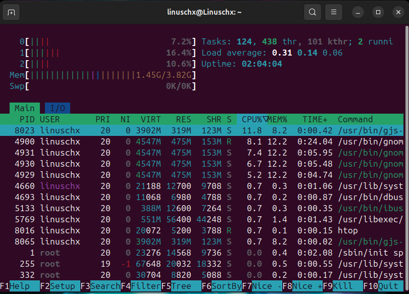
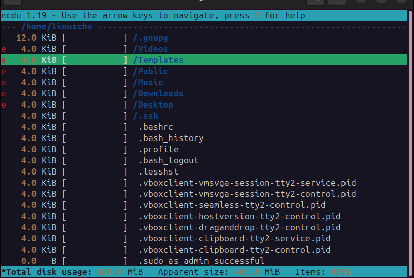
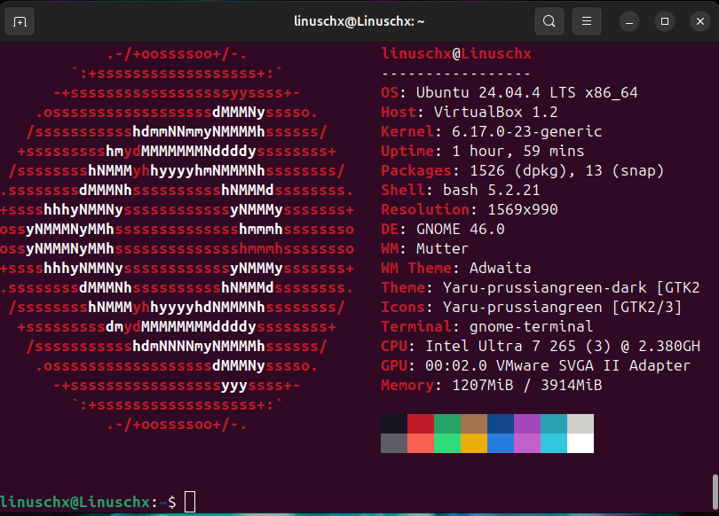
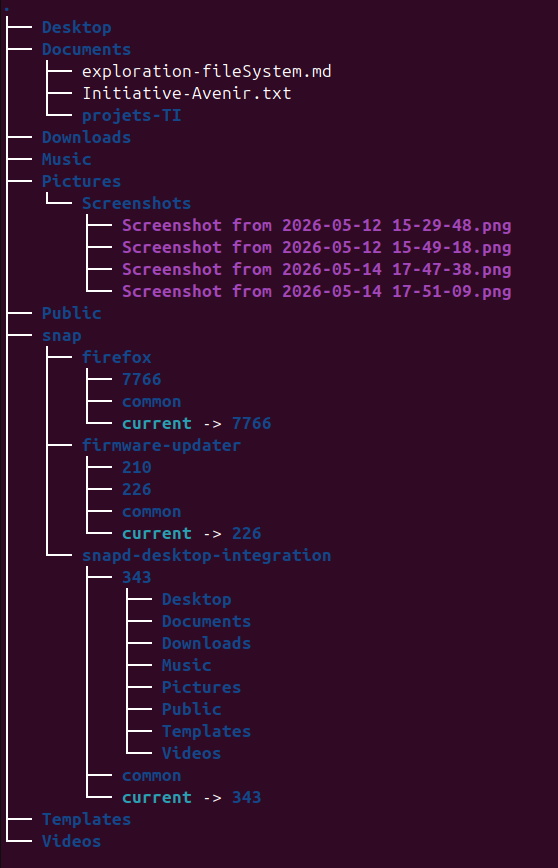

# Documentation de la semaine 3

## htop

Grace a htop, il est possible d'observer les processus qui roulent en arriere plan dans la machine.

## ncdu

Les fichiers sont classes en ordre decroissant de la taille qu'ils occupent sur le disque.

## Neofetch

Neofetch donne les informations importantes de l'appareil

## Tree

Tree ameliore la vue de l'arborescence des dossiers. On peut voir l'interieur des dossiers dans le nombre de couche que l'on souhaite.